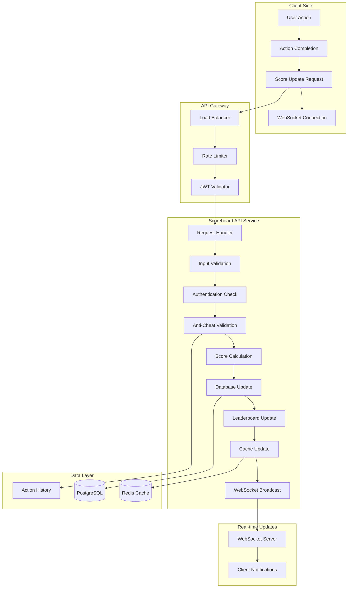
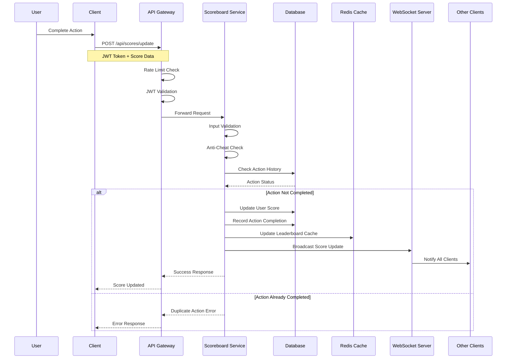
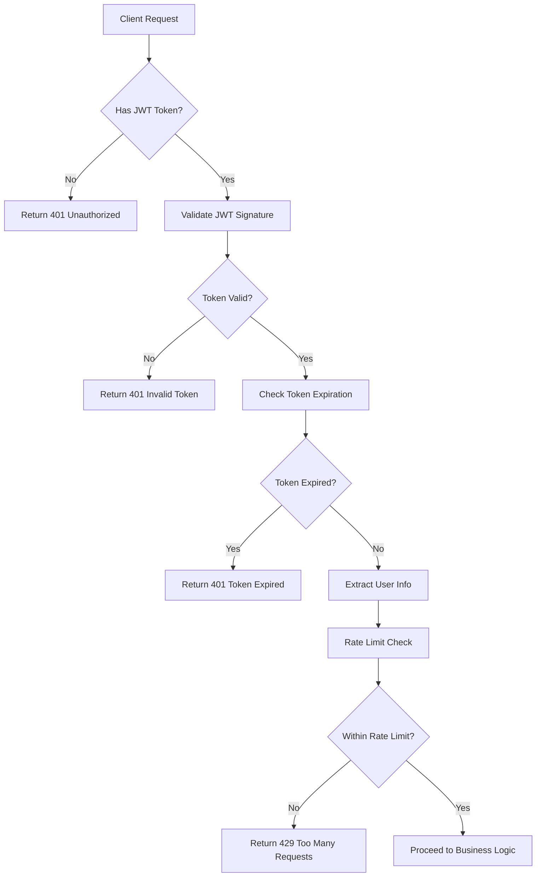
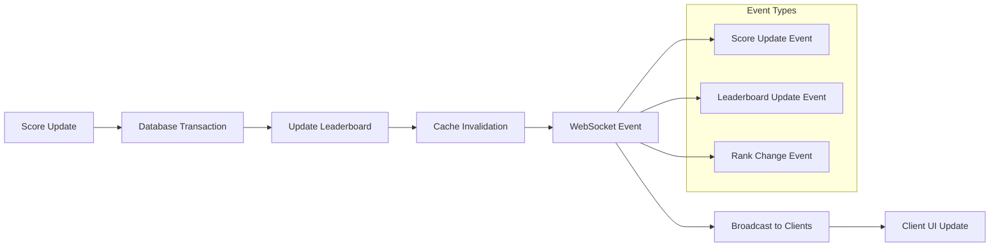
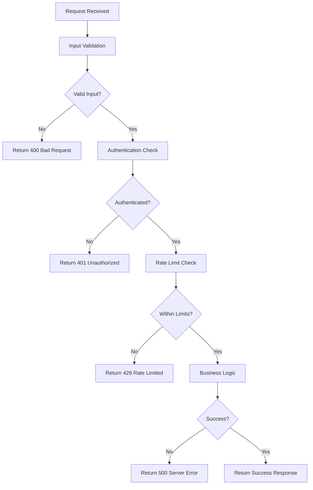
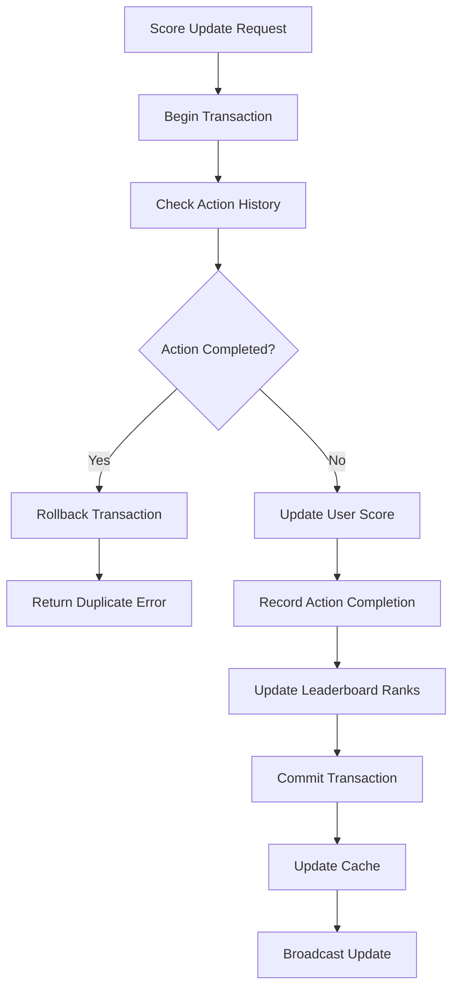
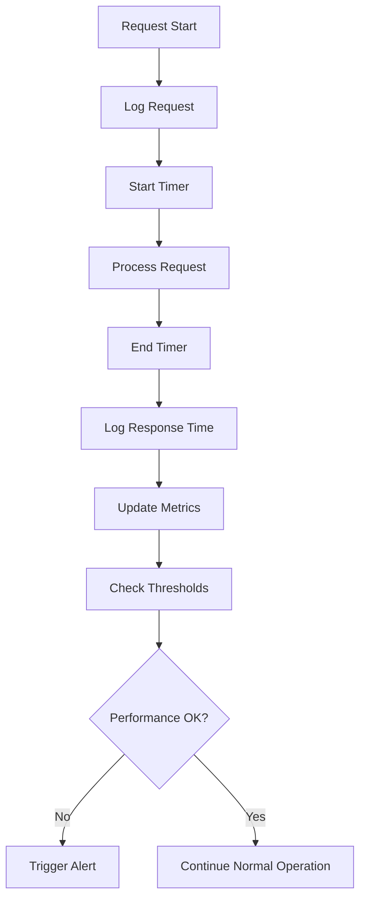
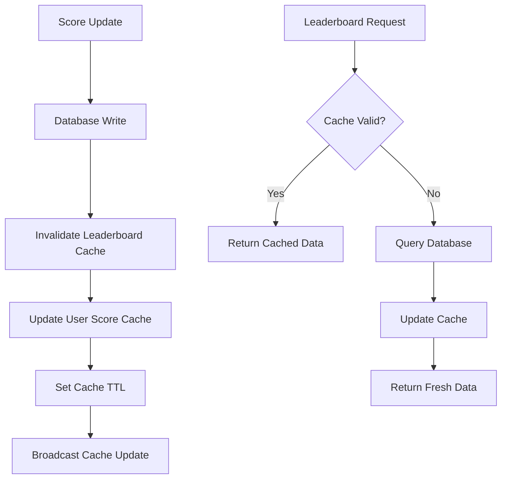
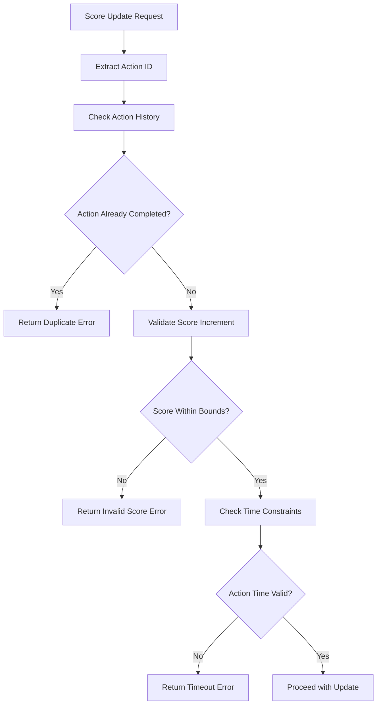

# Scoreboard API Module - Execution Flow Diagram

## System Architecture Flow

## Detailed Score Update Flow

## Authentication & Security Flow

## Real-time Update Flow

## Error Handling Flow

## Database Operations Flow

## Performance Monitoring Flow

## Cache Management Flow

## Anti-Cheat Validation Flow

This comprehensive flow documentation provides the backend engineering team with clear visual representations of how the scoreboard API module should operate, including all the security, performance, and real-time update considerations.
